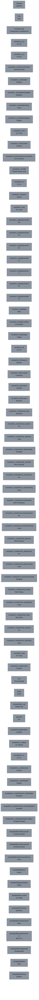

# phpwcms-dev dependency graph

> Generated by [stacklit](https://github.com/glincker/stacklit) on 2026-07-20. Run `stacklit generate` to update.

```mermaid
graph LR
  classDef javascript fill:#c9d1d9,color:#0d1117,stroke:#c9d1d9
  classDef php fill:#8b949e,color:#0d1117,stroke:#8b949e
  classDef ruby fill:#8b949e,color:#0d1117,stroke:#8b949e
  phpstan[".phpstan<br/>.phpstan"]:::php
  img["img<br/>Img"]:::php
  include_config["include/config<br/>Configuration management"]:::php
  include_inc_act["include/inc_act<br/>Inc Act"]:::php
  include_inc_ext["include/inc_ext<br/>Inc Ext"]:::php
  include_inc_ext_ConvertCharset["include/inc_ext/ConvertCharset<br/>ConvertCharset"]:::php
  include_inc_ext_ckeditor["include/inc_ext/ckeditor<br/>Ckeditor"]:::php
  include_inc_ext_ckeditor_adapters["include/inc_ext/ckeditor/adapters<br/>Adapters"]:::php
  include_inc_ext_ckeditor_lang["include/inc_ext/ckeditor/lang<br/>Lang"]:::php
  include_inc_ext_ckeditor_plugins["include/inc_ext/ckeditor/plugins<br/>Plugins"]:::php
  include_inc_front["include/inc_front<br/>Inc Front"]:::php
  include_inc_front_content["include/inc_front/content<br/>Content"]:::php
  include_inc_front_content_cnt_functions["include/inc_front/content/cnt_functions<br/>Cnt Functions"]:::php
  include_inc_front_lib["include/inc_front/lib<br/>Shared library code"]:::php
  include_inc_js["include/inc_js<br/>Inc Js"]:::php
  include_inc_js_jquery["include/inc_js/jquery<br/>Jquery"]:::php
  include_inc_lang["include/inc_lang<br/>Inc Lang"]:::php
  include_inc_lang_backend_de["include/inc_lang/backend/de<br/>De"]:::php
  include_inc_lang_backend_en["include/inc_lang/backend/en<br/>En"]:::php
  include_inc_lang_backend_es["include/inc_lang/backend/es<br/>Es"]:::php
  include_inc_lang_backend_fr["include/inc_lang/backend/fr<br/>Fr"]:::php
  include_inc_lang_backend_it["include/inc_lang/backend/it<br/>It"]:::php
  include_inc_lang_backend_nl["include/inc_lang/backend/nl<br/>Nl"]:::php
  include_inc_lang_backend_pl["include/inc_lang/backend/pl<br/>Pl"]:::php
  include_inc_lang_date["include/inc_lang/date<br/>Date"]:::php
  include_inc_lang_formmailer["include/inc_lang/formmailer<br/>Formmailer"]:::php
  include_inc_lang_image["include/inc_lang/image<br/>Image"]:::php
  include_inc_lib["include/inc_lib<br/>Inc Lib"]:::php
  include_inc_lib_classes["include/inc_lib/classes<br/>Classes"]:::php
  include_inc_lib_constants["include/inc_lib/constants<br/>Constants"]:::php
  include_inc_lib_content["include/inc_lib/content<br/>Content"]:::php
  include_inc_lib_revision["include/inc_lib/revision<br/>Revision"]:::php
  include_inc_module_mod_ads["include/inc_module/mod_ads<br/>Mod Ads"]:::php
  include_inc_module_mod_ads_inc["include/inc_module/mod_ads/inc<br/>Inc"]:::php
  include_inc_module_mod_ads_lang["include/inc_module/mod_ads/lang<br/>Lang"]:::php
  include_inc_module_mod_ads_template["include/inc_module/mod_ads/template<br/>Template"]:::php
  include_inc_module_mod_calendar["include/inc_module/mod_calendar<br/>Mod Calendar"]:::php
  include_inc_module_mod_calendar_inc["include/inc_module/mod_calendar/inc<br/>Inc"]:::php
  include_inc_module_mod_calendar_lang["include/inc_module/mod_calendar/lang<br/>Lang"]:::php
  include_inc_module_mod_feedimport["include/inc_module/mod_feedimport<br/>Mod Feedimport"]:::php
  include_inc_module_mod_feedimport_inc["include/inc_module/mod_feedimport/inc<br/>Inc"]:::php
  include_inc_module_mod_feedimport_lang["include/inc_module/mod_feedimport/lang<br/>Lang"]:::php
  include_inc_module_mod_glossary["include/inc_module/mod_glossary<br/>Mod Glossary"]:::php
  include_inc_module_mod_glossary_inc["include/inc_module/mod_glossary/inc<br/>Inc"]:::php
  include_inc_module_mod_glossary_lang["include/inc_module/mod_glossary/lang<br/>Lang"]:::php
  include_inc_module_mod_glossary_template["include/inc_module/mod_glossary/template<br/>Template"]:::php
  include_inc_module_mod_seolog["include/inc_module/mod_seolog<br/>Mod Seolog"]:::php
  include_inc_module_mod_seolog_lang["include/inc_module/mod_seolog/lang<br/>Lang"]:::php
  include_inc_module_mod_shop["include/inc_module/mod_shop<br/>Mod Shop"]:::php
  include_inc_module_mod_shop_inc["include/inc_module/mod_shop/inc<br/>Inc"]:::php
  include_inc_module_mod_shop_lang["include/inc_module/mod_shop/lang<br/>Lang"]:::php
  include_inc_tmpl["include/inc_tmpl<br/>Inc Tmpl"]:::php
  include_inc_tmpl_content["include/inc_tmpl/content<br/>Content"]:::php
  root["root<br/>Root package"]:::php
  setup["setup<br/>Setup"]:::php
  setup_default_sql["setup/default_sql<br/>Default Sql"]:::php
  setup_inc["setup/inc<br/>Inc"]:::php
  template_config_ckeditor["template/config/ckeditor<br/>Ckeditor"]:::php
  template_inc_default["template/inc_default<br/>Inc Default"]:::php
  template_inc_js["template/inc_js<br/>Inc Js"]:::php
  template_inc_script_access["template/inc_script/access<br/>Access"]:::php
  template_inc_script_felogin["template/inc_script/felogin<br/>Felogin"]:::php
  template_inc_script_frontend_init_disabled["template/inc_script/frontend_init/disabled<br/>Disabled"]:::php
  template_inc_script_frontend_render_disabled["template/inc_script/frontend_render/disabled<br/>Disabled"]:::php
  template_inc_settings_template_default["template/inc_settings/template_default<br/>Template Default"]:::php
  template_lib_cookieconsent2["template/lib/cookieconsent2<br/>Cookieconsent2"]:::php
  template_lib_cookieconsent3["template/lib/cookieconsent3<br/>Cookieconsent3"]:::php
  template_lib_cookieconsent3_core["template/lib/cookieconsent3/core<br/>Core"]:::php
  template_lib_jquery["template/lib/jquery<br/>Jquery"]:::php
  template_lib_jquery_plugin["template/lib/jquery/plugin<br/>Plugin"]:::php
  template_lib_js_cookie["template/lib/js-cookie<br/>Js-cookie"]:::php
  template_lib_mootools["template/lib/mootools<br/>Mootools"]:::php
  template_lib_mootools_more["template/lib/mootools/more<br/>More"]:::php
  template_lib_mootools_more_1_4["template/lib/mootools/more-1.4<br/>More-1.4"]:::php
  template_lib_simplegmaps["template/lib/simplegmaps<br/>Simplegmaps"]:::php
  template_lib_slick["template/lib/slick<br/>Slick"]:::php
  template_lib_slimbox["template/lib/slimbox<br/>Slimbox"]:::php
```
